# Marple
Marple is a Swing-based Java library for analyzing Swing applications. Notable features are:

  - Analysis of hierarchical structure of Swing components including field search
  - Component, image, and color previews when analyzing fields
  - Highlighting of components referenced by fields
  - Analysis support for `Iterable`s, arrays, and `Map`s
  - Expression evaluation in the context of selected components
  - An instance-based search
  - Support for data exchange with debuggers

<!-- START doctoc generated TOC please keep comment here to allow auto update -->
<!-- DON'T EDIT THIS SECTION, INSTEAD RE-RUN doctoc TO UPDATE -->
# Table of Contents

- [Target](#target)
- [Features](#features)
  - [Hierarchical Structure Analysis](#hierarchical-structure-analysis)
  - [Component, Image, and Color Previews](#component-image-and-color-previews)
  - [Highlighting of Components](#highlighting-of-components)
  - [Analysis Support for Iterables, Arrays, and Maps](#analysis-support-for-iterables-arrays-and-maps)
  - [Expression Evaluation](#expression-evaluation)
  - [Instance-based Search](#instance-based-search)
  - [Data Exchange With Debuggers](#data-exchange-with-debuggers)
  - [Navigation](#navigation)
- [Default Shortcuts](#default-shortcuts)
- [Setup and Configuration](#setup-and-configuration)
  - [Component Hierarchy Model](#component-hierarchy-model)
  - [Evaluation Settings](#evaluation-settings)
  - [Visual Settings](#visual-settings)
    - [Object Views](#object-views)
  - [Security Settings](#security-settings)
  - [Debug Settings](#debug-settings)
  - [Key Settings](#key-settings)
  - [Parser Settings](#parser-settings)
- [Navigable Elements](#navigable-elements)
- [Actions](#actions)
  - [Inspect Action](#inspect-action)
  - [Highlight Component Action](#highlight-component-action)
  - [Snapshot Action](#snapshot-action)
  - [Add to Variables Action](#add-to-variables-action)
  - [Evaluate and Evaluate as Action](#evaluate-and-evaluate-as-action)
  - [Search Instances from Here and Search this Instance Action](#search-instances-from-here-and-search-this-instance-action)
  - [Copy String Representation Action](#copy-string-representation-action)
  - [Debug Support Action](#debug-support-action)
  - [Invoke Action](#invoke-action)
- [Inspection Dialog](#inspection-dialog)
  - [Component Hierarchy Tab](#component-hierarchy-tab)
  - [Fields Tab](#fields-tab)
  - [Methods Tab](#methods-tab)
  - [Iterables Tab](#iterables-tab)
    - [Lambdas](#lambdas)
    - [Filter](#filter)
    - [Map](#map)
    - [ForEach](#foreach)
    - [Collect](#collect)
    - [ToMap](#tomap)
    - [Count](#count)
    - [Group](#group)
    - [Stream-like Analysis](#stream-like-analysis)
  - [Maps Tab](#maps-tab)
    - [Filter](#filter-1)
    - [Map](#map-1)
- [Evaluation Dialog](#evaluation-dialog)
  - [Evaluation Settings](#evaluation-settings-1)
    - [Evaluation Modes](#evaluation-modes)
    - [Variables](#variables)
    - [Imports](#imports)
    - [Custom Hierarchy](#custom-hierarchy)
- [Snapshot Dialog](#snapshot-dialog)
- [Debug Support](#debug-support)
    - [Unnamed Slots](#unnamed-slots)
    - [Named Slots](#named-slots)
    - [Importing and Exporting Variables](#importing-and-exporting-variables)
    - [Breakpoint Trigger](#breakpoint-trigger)
- [Search Dialog](#search-dialog)
- [Open Source License Acknowledgement](#open-source-license-acknowledgement)
  - [AutoComplete](#autocomplete)
  - [Guava: Google Core Libraries for Java](#guava-google-core-libraries-for-java)
  - [Zenodot](#zenodot)

<!-- END doctoc generated TOC please keep comment here to allow auto update -->

# Target
Marple has been developed for two reasons:

  1. To analyze the UI structure of Swing applications. One aspect is the analysis of the component hierarchy described by the parent-child relationship between Swing components. The second aspect is analyzing how the hierarchy is represented by the code. For this, Marple scans fields values of components in the hierarchy and matches them against other components. By doing so, anonymous object references in the JVM are mapped to named fields in the source code. This can help developers to understand how the UI code matches the resulting visualization. 

  1. For some applications, the UI is a good entry point for debugging. This is particularly the case if there is a connection between the Swing components and core classes via object references. Marple provides code evaluation facilities via the *Zenodot* library, which allows developers to evaluate code in the context of a selected Swing component.

# Features

## Hierarchical Structure Analysis

To start the hierarchical structure analysis, hover over the component you want to analyze and then press the inspection shortcut. The default shortcut is `Ctrl + Shift + I`. The inspection dialog pops up. The dialog contains multiple tabs. The first tab ["Component Hierarchy"](#component-hierarchy-tab) shows a linear tree from the Swing root component to the component under the mouse. Marple also searches for fields that reference the components in this tree. This is particularly interesting because you get information about where in the code which part of this hierarchy is generated.

## Component, Image, and Color Previews

Marple can display previews of `JComponent`s, `Image`s, and `Paint`s, which includes `Color`s. The [snapshot dialog](#snapshot-dialog) is opened via the [snapshot action](#snapshot-action). One handy feature are live previews that are created when hovering over [navigable elements](#navigable-elements).

## Highlighting of Components

While the [component hierarchy tab](#component-hierarchy-tab) helps you finding GUI elements in your code, the [highlight component action](#highlight-component-action) helps you finding components you have encountered during your analysis on the screen by letting it flash multiple times.

## Analysis Support for Iterables, Arrays, and Maps

The ["Iterables" tab](#iterables-tab) in the inspection dialog offers common operations for `Iterable`s and arrays: Filter, Map, ForEach, Collect, ToMap, Count, and Group. Similarly, the ["Maps" tab](#maps-tab) offers common operations for `Map` keys and values: Filter and Map.

## Expression Evaluation

Marple allows you to evaluate expressions. These expressions are evaluated in a certain context. This context can be referred to by the keyword `this`. Instead of `this.myField` or `this.myMethod()` you can simply write `myField` or `myMethod()` when referring to the field `myField` or the method `myMethod()` of the context object. Some notable features for expression evaluation are:

  * Different [evaluation modes](#evaluation-modes): You can choose between static typing, dynamic typing, and a mixed mode. With dynamic typing, runtime types rather than declared types are used when evaluating expressions and suggesting code completions. This can save tedious casts.
  * Class and package [imports](#imports) 
  * Definition of [variables](#variables) that can be used within expressions
  * A language extension that allows navigating in a [custom, application-specific hierarchy](#custom-hierarchy)  

Expressions are evaluated in the [evaluation dialog](#evaluation-dialog).

## Instance-based Search

Marple allows you to find paths from one instance to another instance or all instances of a certain class satisfying a specific search criterion. If the field of an instance `x` references and instance `y`, then `(x, y)` is considered a (directed) edge in the search graph from node `x` to node `y`. The search can be used to analyze memory leaks or to track where certain parameters given to a method are internally stored.

See [Search Dialog](#search-dialog) for details.

## Data Exchange With Debuggers

The in-application debugging capabilities are a nice feature, but they are negligible compared to what real debuggers are capable of. Having that said, Marple is still valuable for your debugging process because it gives you good entry points via the GUI components of your application. Data exchange between Marple and the debugger is done via the [debug support dialog](#debug-support). 

## Navigation

The GUI elements of your application are the entry points for the analysis with Marple. From there you can navigate along fields in the inspection dialog, analyze the result of expressions in the evaluation dialog, or search for instances in the search dialog. Many Marple elements provide a context menu that offers several options to continue the investigation. These elements are called ["navigable elements"](#navigable-elements).

Additionally, the inspection and the evaluation dialog maintain a history of inspected or evaluated objects, respectively. This allows you to continue your investigation at an object you have analyzed earlier or to look something up in the history and then continue your current investigation.    

# Default Shortcuts

All shortcuts can be configured. Unless changed, the shortcuts are as follows:

|Shortcut|Action|
|---|---|
|`Ctrl + F1`|Quick Help dialog showing the actual shortcuts|
|`Ctrl + Shift + I`|Inspection dialog|
|`Alt + F8`|Expression Evaluation dialog|
|`Ctrl + Shift + F`|Find Instance dialog|
|`Ctrl + Shift + D`|Debug Support dialog|
|`Ctrl + Space`|Suggest code completions for expressions|
|`Ctrl + P`|Show method argument types|

If you cannot remember the shortcuts, then you can look them up in the Quick Help that displays the actual shortcuts:


Hence, the shortcut for the Quick Help is the only one you have to know initially.

# Setup and Configuration

To set up Marple, you have to 

* create and configure an `InspectionSettingsBuilder`,
* build `InspectionSettings` by calling `InspectionSettingsBuilder.build()`, and
* register the settings via `ObjectInspectionFramework.register(inspectionSettings)`. 

An `InspectionSettingsBuilder` can be created by either calling

  * `InspectionSettingsBuilder.create()` or
  * `ObjectInspectionFramework.createInspectionSettingsBuilder()`.

The first call creates an empty builder, while the second call creates a preconfigured builder that

  * recognizes nodes of `JTree`s, items of `JList`s, and cells of `JTable`s as [subcomponents](#component-hierarchy-model),
  * defines text representations of several Swing components, and
  * registers the [fields tab](#fields-tab), the [methods tab](#methods-tab), the [iterables tab](#iterables-tab), and the [maps tab](#maps-tab) for the inspection dialog.  

`InspectionSettings` consist of

  * an immutable part that has to be configured by the `InspectionSettingsBuilder` and
  * a mutable part that is intended to be configurable by the user.

The only mutable settings are the [settings for the parser](#parser-settings) that can be configured in the [evaluation settings dialog](#evaluation-settings-1).  
    
In the remainder of this section we discuss the different types of settings.

## Component Hierarchy Model

Marple lets you analyze, among others, the hierarchy of Swing components. However, not every graphic element is a full-blown Swing component. We call such elements "subcomponents". It makes sense to see subcomponents in the hierarchy as well. By default, Marple supports the following subcomponents:

  * nodes in a `JTree`
  * items in a `JList`
  * cells in a `JTable`

Subcomponents might also be structured hierarchically. These structures are described by the interface `ComponentHierarchyModel`. Instances of `ComponentHierarchyModel` are created via the `ComponentHierarchyModelBuilder`. There are different ways to create a builder instance:

  1. The method `ComponentHierarchyModelBuilder.create()` creates an empty builder.
  1. The method `ObjectInspectionFramework.createComponentHierarchyModelBuilder()` that already supports the aforementioned subcomponents.

The builder allows you to add `SubcomponentHierarchyStrategy` instances that return a list of subcomponents for a given component and a given point inside the component. Since in many cases there will be at most one subcomponent and no hierarchy of subcomponents, there is a utility method `ComponentHierarchyModels.createSingleSubcomponentStrategy` that simplifies the creation of such strategies a bit. For the registration of nodes in a `JTree`, the code could look as follows:

```
builder.subcomponentHierarchyStrategy(JTree.class, createSingleSubcomponentStrategy((tree, point) -> {
	TreePath path = tree.getPathForLocation(point.x, point.y);
	return path == null ? null : path.getLastPathComponent();
}));
```
Note that the bi-function that you have to specify for the method `createSingleSubcomponentStrategy()` may return `null` if there is no subcomponent for the specified position.

## Evaluation Settings

The interface `EvaluationSettings` contains information about what will be displayed when the evaluation dialog is opened for certain objects. You can create an instance of `EvaluationSettings` via its builder that you obtain via `EvaluationSettingsBuilder.create()`.

`EvaluationSettings` do not influence how expressions are evaluated. This can be achieved by specifying `ParserSettings` (see Section [Parser Settings](#parser-settings)). Instead, `EvaluationSettings` allow you to specify

The `EvaluationSettingsBuilder` provides 2 methods:

  1. The method `suggestExpressionToEvaluate` lets you specify which expression to display initially for which object. When nothing is specified for a certain object, then `this` is displayed.
  
  1. The method `addRelatedObjectsProvider` lets you specify which related objects to show in a dedicated panel when evaluating a certain object.

## Visual Settings

The interface `VisualSettings` describes how to display objects as text and which tabs are available in the [inspection dialog](#inspection-dialog) for which object. You can create an instance of `VisualSettings` via the `VisualSettingsBuilder`. There are different ways to create a `VisualSettingsBuilder`:

  1. The method `VisualSettingsBuilder.create()` creates an empty builder.
  1. The method `ObjectInspectionFramework.createVisualSettingsBuilder()` creates a builder with the default settings used by Marple.

You can also create an empty builder and call `VisualSettingsUtils.addDefaultDisplayTextFunctions(builder)` or `VisualSettingsUtils.addDefaultViews(builder)` to add the Marple default settings of only one of the two aspects of `VisualSettings`.

The `VisualSettingsBuilder` provides 3 methods:

  1. The method `nullDisplayText` lets you specify a String that is used to display the value `null`.

  1. The method `displayText` lets you specify how to display objects of a certain class. Marple currently defines special logic to display instances of the following classes: `String`, `char`/`Character`, `Object`, `Frame`, `AbstractButton`, `JLabel`, and `JTextComponent`. A sample usage of the method is `builder.displayText(char.class, c -> "'" + c + "'")`. 

  1. The method `objectView` lets you specify constructors/factory methods for `ObjectView` instances for a certain type of object. Each `ObjectView` describes one tab in the inspection dialog. The available tabs depend on the inspected object. Note that the class argument only serves as a first filter for deciding which tabs to create and which not. The factory method you provide may return `null` if there should be no tab for a given object although the class is as expected.

### Object Views

Instances of `ObjectView` describe tabs in the inspection dialog. The method `getViewName()` is used to determine the tab title. The method `getViewComponent()` returns the component that is displayed on the tab.

`ObjectView`s provide a way to store and load their current settings via the methods `getViewSettings()` and `applyViewSettings()`. There are two scenarios when view settings are applied:

  1. When navigating in the inspection history by using the "Back" and "Forward" buttons, then the view settings associated with the element in the history are restored.
  
  1. When inspecting a new object, then the current view settings are applied as good as possible and reasonable to the view for the new object.

As a rule of thumb, general settings are always applied, whereas object-dependent settings are only applied in the first scenario. To distinguish between both scenarios, the method `applyViewSettings()` gets an argument of type `ObjectView.ViewSettingsOrigin` describing where the view settings stem from: `ObjectView.ViewSettingsOrigin.SAME_CONTEXT` refers to the first scenario, in which all settings should be applied. `ObjectView.ViewSettingsOrigin.OTHER_CONTEXT` refers to the second scenario, in which only general settings should be transferred.

## Security Settings

If you decide to ship Marple with your application, then you might want to prevent your customers from analyzing your application with Marple. To do so, you can subclass the interface `SecuritySettings` to protect the Marple access by a password prompt. Marple does neither restrict the way the password prompt is implemented nor does it provide utilities for implementing it. 

## Debug Settings

The interface `DebugSettings` currently only contains information about the configurable breakpoint trigger. You have to subclass it in order to specify a custom breakpoint trigger. The breakpoint trigger is a `Runnable` that is called when the user presses the "Trigger" button in the [debug support dialog](#debug-support). By default, the method `DebugSupport.triggerBreakpoint()` is called. See [Breakpoint Trigger](#breakpoint-trigger) for a detailed explanation.

## Key Settings

The interface `KeySettings` contains all information about configurable shortcuts. You can create a `KeySettings` instance with a `KeySettingsBuilder`. The method `KeySettingsBuilder.create()` creates such a builder, preconfigured with the [default shortcuts](#default-shortcuts).

## Parser Settings

Parser/evalution settings are the only settings that are partially configurable by the user. These settings control how expressions are evaluated. In most cases it is helpful to preconfigure these settings appropriately. You can set the parser settings of an instance of `InspectionSettings` as follows:

```
inspectionSettings.getEvaluator().setParserSettings(parserSettings)
```

`ParserSettings` are generated by the `ParserSettingsBuilder` which is created by `ParserSettingsBuilder.create()`. 

The builder allows you, among others,

  * to configure the behavior of code completions (currently not configurable via API)
  * to specify the [imports](#imports) (classes and packages),
  * to specify the minimum access modifier (`private`, `package private`, `protected`, or `public`) a field or method must have in order to be accessed from within expressions
  * to choose the [evaluation mode](#evaluation-modes)
  * to predefine [variables](#variables), which you can create via `ParserSettingsUtils.createVariable`
  * to specify a [custom hierarchy](#custom-hierarchy)   

See the [parser settings](https://github.com/tbrunsch/Zenodot#parser-settings) documentation of Zenodot for more details on these features.

# Navigable Elements

Marple uses GUI components of your application as entry points for you analysis. However, you are not bound to these components. Most of the dialogs contain navigable elements. These elements provide a context menu if you right-click onto them. The "inspect" action is the default action which will be executed when you left-click onto a navigable element. In this section we show examples of navigable elements:

* Nodes in the ["Component Hierarchy" tab](#component-hierarchy-tab) in the inspection dialog:<br/>


* Nodes in the quick view and values in the detailed view of the ["Fields" tab](#fields-tab) in the inspection dialog:<br/>
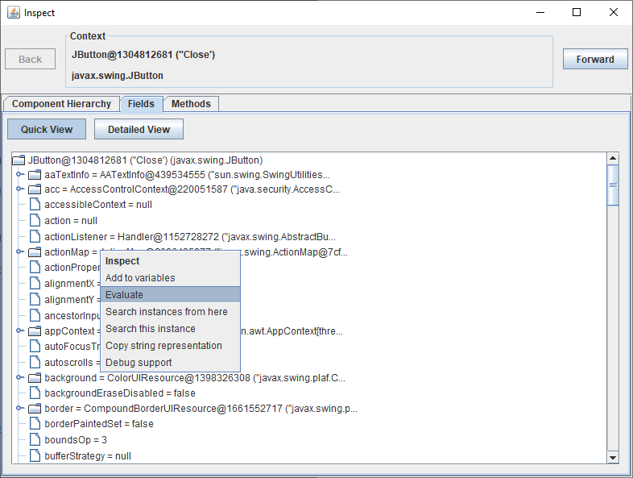<br/><br/>
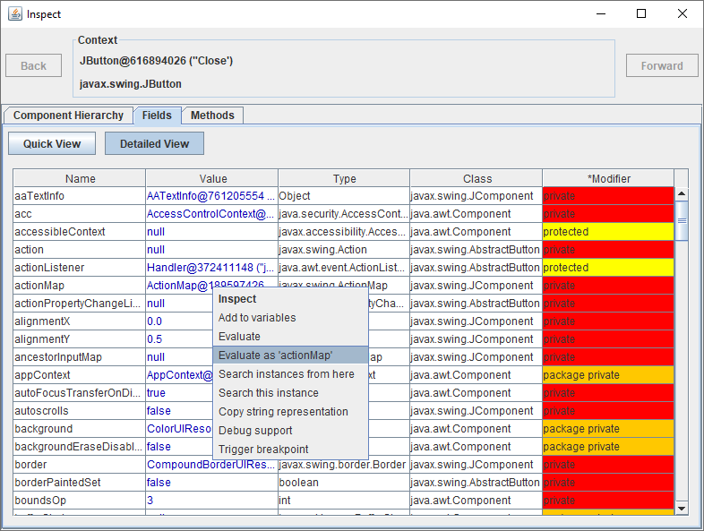

* Nodes in the quick view and methods in the detailed view of the ["Methods" tab](#methods-tab) in the inspection dialog:<br/>
<br/><br/>


* Nodes in all result panels like in the [evaluation dialog](#evaluation-dialog):<br/>


* Values in the variables tab and nodes in the custom hierarchy tab in the [settings](#evaluation-settings-1) for expression evaluation:<br/>
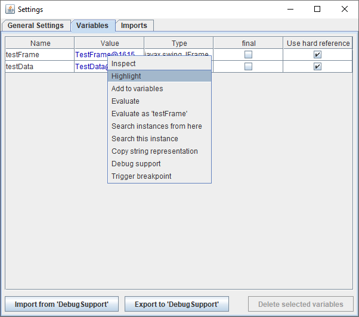<br/><br/>


* Values of unnamed and named slots in the [debug support dialog](#debug-support):<br/>
<br/><br/>


# Actions

Navigable elements provide several actions that can be selected from the context menu that pops up when right-clicking onto such an element. See [Navigable Elements](#navigable-elements) for example context menus.

## Inspect Action

The "Inspect" action opens the [inspection dialog](#inspection-dialog) with the object represented by the navigable element as context.

## Highlight Component Action

The "Highlight Component" action is only available for `Component`s. When executing this action, then the component flashes repeatedly for a short time span. This is helpful if you are exploring fields of a class and want to know where the component this field points to is located on the screen. Of course this only works if the component is currently visible on the screen.

## Snapshot Action

The "Snapshot" action is available for `JComponent`s, `Image`s, `Icon`s, and `Paint`s. This action opens the [snapshot dialog](#snapshot-dialog) that displays the component/image/icon/paint and allows you to save it or copy it to the clipboard.

## Add to Variables Action

You can introduce [variables](#variables) to reference instances within expressions. This is done by the "Add to variables" action.

## Evaluate and Evaluate as Action

The "Evaluate" and "Evaluate XXX" action both open the [evaluation dialog](#evaluation-dialog). The only difference is that the "Evaluate" action opens the dialog using the object that is represented by the navigable element as context that can be referred to by the keyword `this`. In contrast to this, the "Evaluate XXX" action, which is not always available, used a context in which XXX refers to the object.

Example: Consider the detailed view in the ["Fields" tab](#fields-tab) of the inspection dialog:


Assume that a `JButton` is the current context of the inspection dialog and consider the navigable element for the field `actionMap`. The "Evaluate" action will open the evaluation dialog with the value of the field `actionMap` as context, i.e., the keyword `this` will refer to `actionMap`. The "Evaluate 'actionMap'" action will open the evaluation dialog with the `JButton` as context. In that case, the keyword `this` refers to the button and the expression `actionMap`, which will be the initial text in the expression text field, will refer to `actionMap`. 

## Search Instances from Here and Search this Instance Action

Both actions open or configure the open [search dialog](#search-dialog) where you can search instances from a start instance. Depending on which action you have chosen, the object of the navigable element will be used as start or as target instance for the search dialog.

## Copy String Representation Action

This action copies the value returned by `toString()` of the object represented by the navigable element to the clipboard. 

## Debug Support Action

This action opens the [debug support dialog](#debug-support).

## Invoke Action

This action is only available for navigable elements that represent methods without argument. When this action is executed, then this method is executed and its result is used as new context of the inspection dialog. 

# Inspection Dialog

The inspection dialog is a tool to analyze objects. There are two ways to open this dialog:

  1. You can hover over a Swing component and press the inspection shortcut. The default shortcut is `Ctrl + Shift + I`. The inspection dialog becomes visible with the component as context, i.e., all tabs refer to this component.     

  1. You can left-click onto any navigable element. The inspection dialog becomes visible with the object represented by that element as context.

The inspection dialog can consist of up to five predefined tabs:

  * the ["Component Hierarchy" tab](#component-hierarchy-tab),
  * the ["Fields" tab](#fields-tab),
  * the ["Methods" tab](#methods-tab),
  * the ["Iterables" tab](#iterables-tab), and
  * the ["Maps" tab](#maps-tab).

The "Fields" and the "Methods" tab are always available. The "Component Hierarchy" tab is only available if the selected object is a Swing component or a supported subcomponent (see [Component Hierarchy Model](#component-hierarchy-model)). The "Iterables" tab is only available if the selected object is an `Iterable` or an array. The "Maps" tab is only visible if the selected object is a `Map`.

You can explore related instances by clicking on

* component hierarchy tree nodes,
* fields, or
* methods without parameters.

When you do so, the tabs are updated showing the information for the newly selected instance. You can use the "Back" and "Forward" buttons to navigate in the history of selected instances. The history will be cleared when the inspection dialog is closed.

## Component Hierarchy Tab

The "Component Hierarchy" tab is only visible if the selected object is a Swing component or a supported subcomponent (e.g. `TreeNode`s). It is possible to extend Marple to recognize custom subcomponents (see [Component Hierarchy Model](#component-hierarchy-model)). The tab shows a linear tree from the Swing root component to the selected (sub)component:

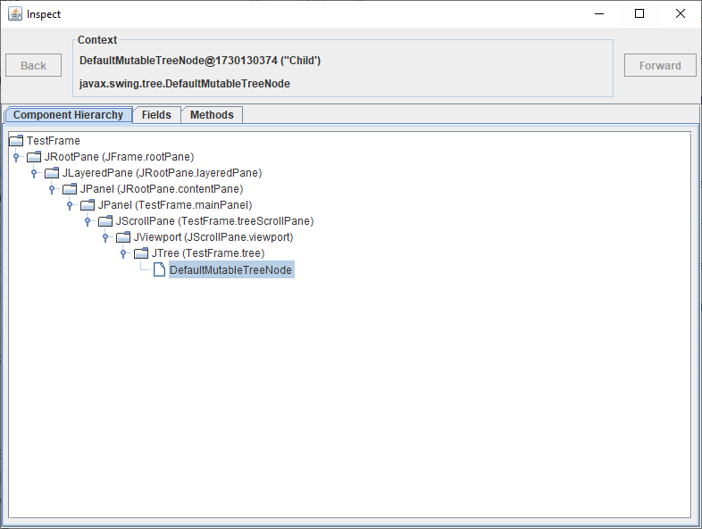

The node names in the tree contain the class names of the components. In some cases there will be additional information embraced in parentheses. These are fields of classes that reference the component the node represents. That way, you do not only obtain information about the hierarchical Swing component structure, but also about the code that generates this structure. Whenever you need to modify one of these components, you get a hint where to look in the code.  

In the screenshot above one can see that the user tried to analyze a `DefaultMutableTreeNode`. Marple does not only show that this is a node in an arbitrary `JTree`, but that this `JTree` instance is referenced by the field `tree` of the class `TestFrame`.

## Fields Tab

The "Fields" tab lists all fields of the selected object. Two views are available: In the "Quick View" you get an overview over all fields of the selected object in form of a tree. You can simply expand field nodes to analyze their fields:

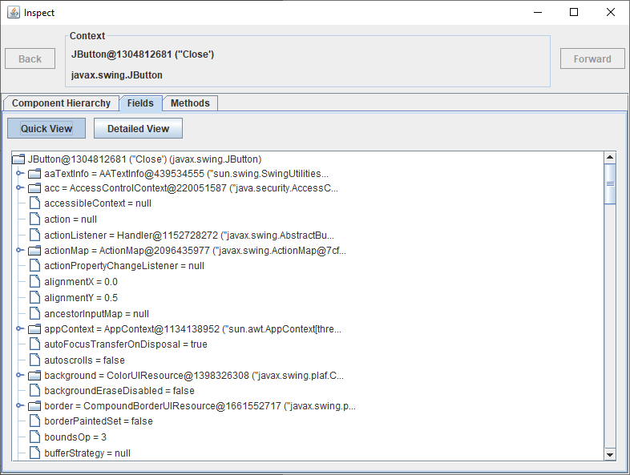

If there are many fields and you have to search for a field, then the "Detailed View" may be the right option:


In the "Detailed View" you can sort fields by name, value, type, declaring class, or modifier. For this, you simply left-click onto the corresponding column header. You can also filter fields by specifying filters for one ore more columns. For this, right-click onto the corresponding column headers and configure the filter. There are three types of filters:

  * Text-based filters match String representations of objects against the specified filter text:<br/>
  <br/>
  Text-based filters support camel case search ("aC" matches "accessibleContext" and "appContext") and wildcards ("*").  
  
  * Selection-based filters provide a set of possible values from which you can select one or more values:<br/>
  
   
  * The modifier filter allows you to specify the minimum visibility a field should have in order to be shown in the table. Additionally, you can specify whether to show static fields or not:<br/>
  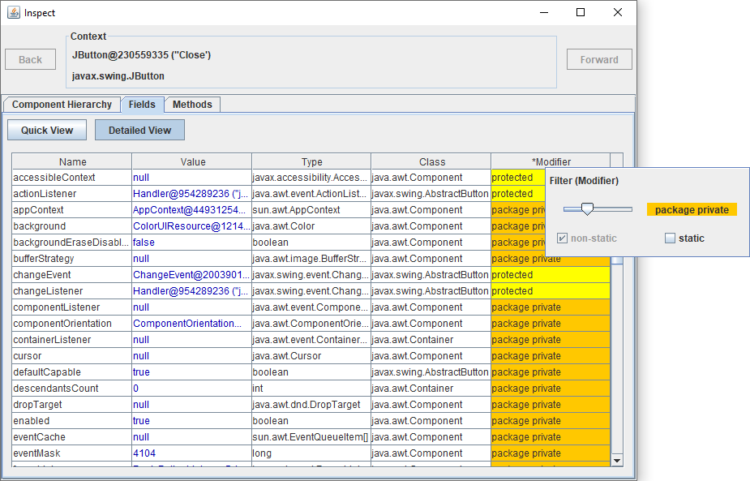

## Methods Tab

Similar to the "Fields" tab, the "Methods" tab lists all methods of the selected object. In the "Quick View", you get an overview over all available methods. You can use the method name filter and the modifier filter to search for methods:


If you need more options for filtering, then you can use the "Detailed View":


Like in the "Detailed View" of the "Fields" tab, you can sort methods according to the criteria specified by the column headers by left-clicking onto these headers. You can also filter the methods by right-clicking onto the column headers and specifying a text-based, a selection-based, or a modifier filter, depending on the column you selected.   

## Iterables Tab

The "Iterables" tab is only visible if the selected object is an `Iterable` or an array. This tab provides common operations on `Iterable`s (Filter, Map, ForEach, Collect, ToMap, Count, and Group). We will discuss these operations in the remainder and how to use them for a stream-like analysis. 

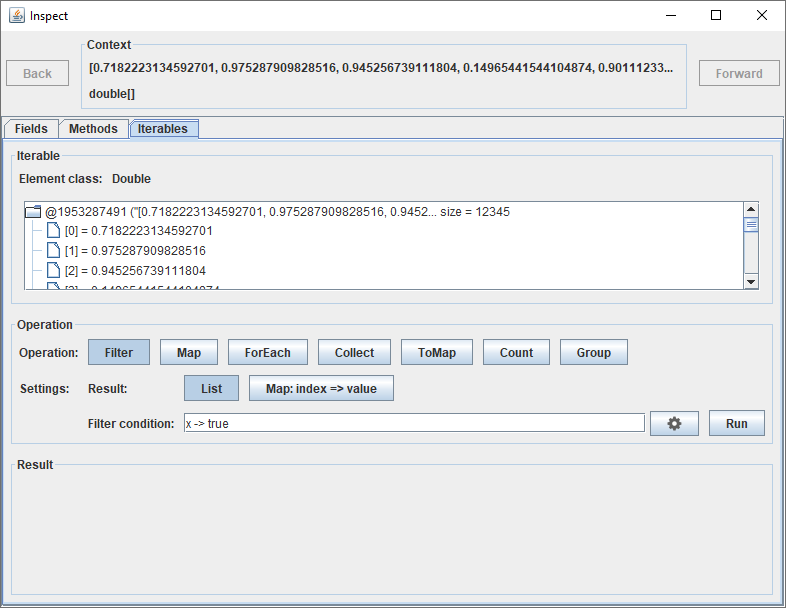

### Lambdas

Zenodot, the library Marple uses to evaluate expressions, supports lambdas. However, due to the lack of type inference, implementing generic functional interfaces by a lambda is a bit tedious because you have to cast the parameters to the correct type when accessing them. This is why Marple uses a different notation for lambdas with one parameter for the "Iterables" tab: The body of the lambda is written as an expression or a statement expressed in terms of `this`. The keyword `this` refers to each element in the `Iterable`, one after another.

*Examples:*

  1. A predicate that checks whether an element is greater than 0.9 is written as `this > 0.9` (instead of `x -> x > 0.9`).
  1. A function that maps an element to its String representation is written as `this.toString()` (instead of `x -> x.toString()` or `Object::toString`). Note that you can omit `this` in this case and simply write `toString()`.
  1. A consumer that prints an element to the console is written as `System.out.println(this)` (instead of `x -> System.out.println(x)` or `System.out::println`).

### Filter

You can specify an arbitrary predicate that is applicable to the elements of the `Iterable`. When pressing the "Run" button, the `Iterable` is filtered with this predicate and the result is displayed at the bottom.

The output (if any) can either be a list or an index map. If you are only interested in the filtered elements, then you should choose a list:

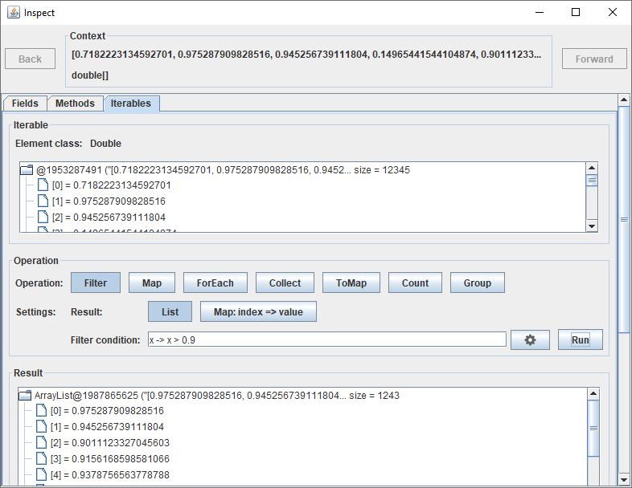 

If you are interested in the original indices of the filtered elements, then you should select the index map:

 

As can be seen in the screenshot, the result is a map from original indices to values. 

We decided to keep the number of operations at a minimum. Many other common operations can be solved via a filter:

  1. `contains`, `anyMatch`, `noneMatch`: Filter with the predicate and check whether the output is empty or not.
  1. `allMatch`: Filter with the negated predicate and check whether the output is empty or not.
  1. `find`/`indexOf`: Select as output type an index map and filter with the predicate.    

### Map

You can specify an arbitrary (unary) function that is applicable to the elements of the `Iterable`. All elements will be mapped by this function and collected into a list:

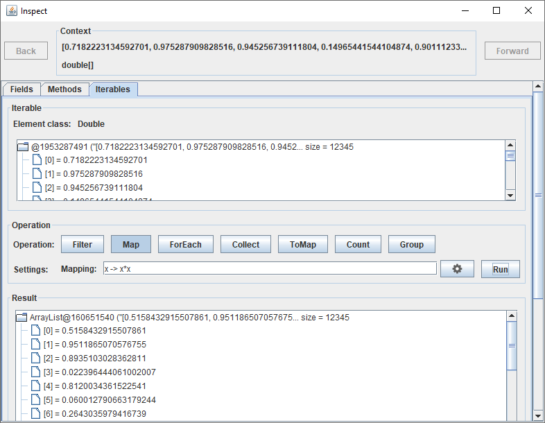

In this example, each value is mapped to its square by using the expression `this*this`, which corresponds to the lambda `x -> x*x` in Java notation.  

### ForEach

You can specify an arbitrary consumer that is applicable to the elements of the `Iterable`. The consumer will subsequently be called for all elements:

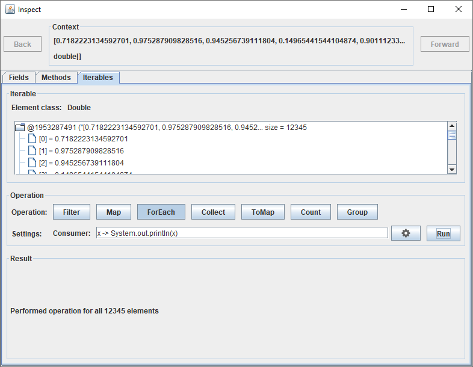

In this example, all elements of the `Iterable` have been printed to the console.

### Collect

You can transform `Iterables` and arrays to other `Collection`s or arrays. For this, you have to specify an expression that constructs the desired `Collection`/array:  

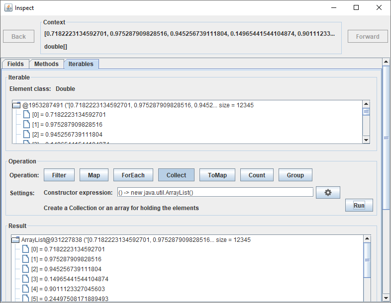

It is not necessary to specify the correct size. You may, e.g., create an empty array. Marple will detect and set the size correctly.

### ToMap

You can transform `Iterables` and arrays to a `Map` by specifying a key mapping and a value mapping:


### Count

You can specify a mapping that assigns a group to each element of the `Iterable` and then count the number of elements in each group:


In this example, the number of elements of the `Iterable` that fall into the intervals [0.0, 0.1), [0.1, 0.2), ..., [0.9, 1.0), respectively, are counted. These intervals are represented by the numbers 0, 1, ..., 9. 

### Group

The group operation is very similar to the count operation. The only difference is that here we are not interested in the number of elements in each group, but in the elements in these groups themselves:

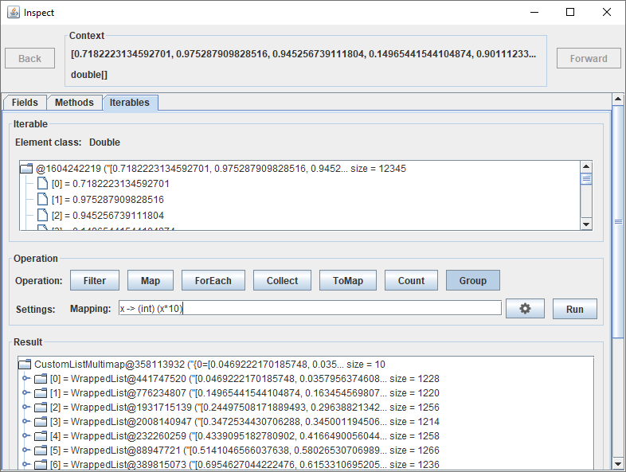

In this example, all elements of the `Iterable` that fall into the intervals [0.0, 0.1), [0.1, 0.2), ..., [0.9, 1.0), respectively, are lister per interval. These intervals are represented by the numbers 0, 1, ..., 9. 

### Stream-like Analysis

The "Iterables" tab provides a way to analyze `Iterable`s similar to the streaming approach. The result of an operation is displayed at the bottom of the dialog. If it is a list (you will not use an index map as result type during streaming) and you click onto that list, then the inspection dialog uses that newly selected list as context and updates all tabs. Since that list is an `Iterable` as well, you remain in the "Iterables" tab. Hence, you can apply the next streaming operation.

Note that with that workflow you benefit from the inspection history, which you can navigate in using the "Back" and "Forward" buttons.

*Example:* Consider the following stream operations on a `double` array "values":

```
    Arrays.stream(values)
        .filter(x -> x > 0.999)
        .map(Math::acos)
        .forEach(System.out::println);
```

To resemble these in the "Iterables" tab, the following steps are required, assuming that "values" is the initially selected object:

  1. Filter values that are greater than 0.999: <br/>   
  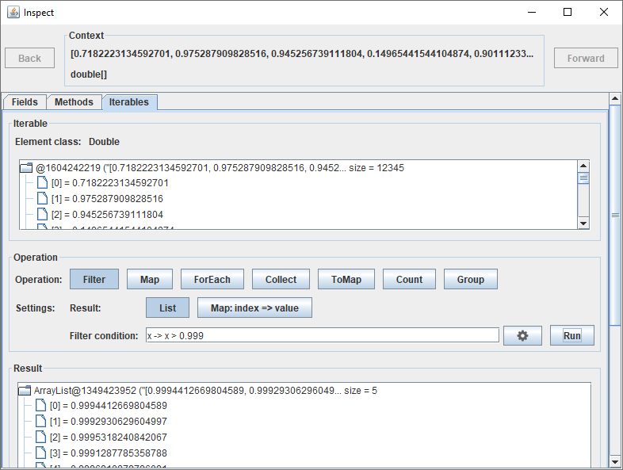   

  1. Left-click onto the resulting `ArrayList` to use it as new context: <br/>  
  

  1. Map values to the inverse cosine: <br/>    
  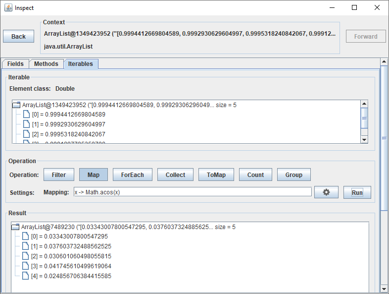   

  1. Left-click onto the resulting `ArrayList` to use it as new context: <br/>  
  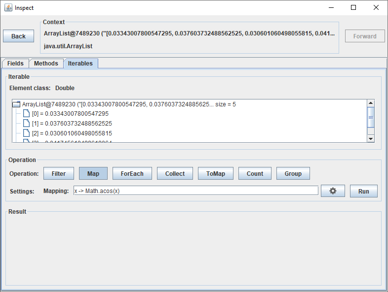

  1. Print values to the console: <br/>  
  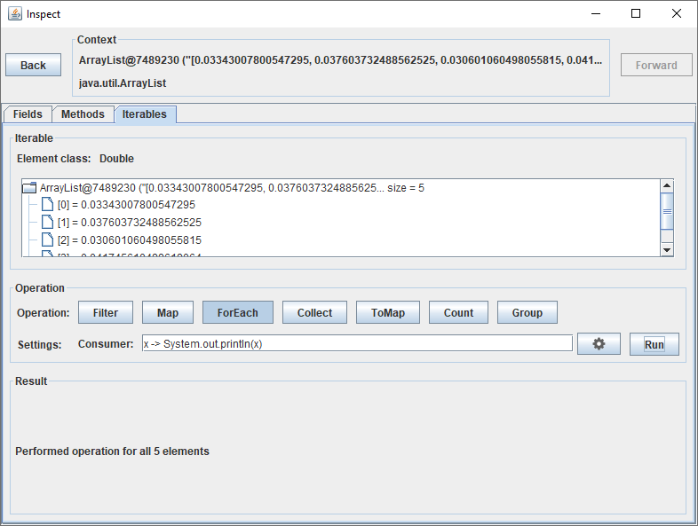

## Maps Tab

The "Maps" tab is only visible if the selected object is a `Map`. This tab provides common operations on `Map`s (Filter and Map):

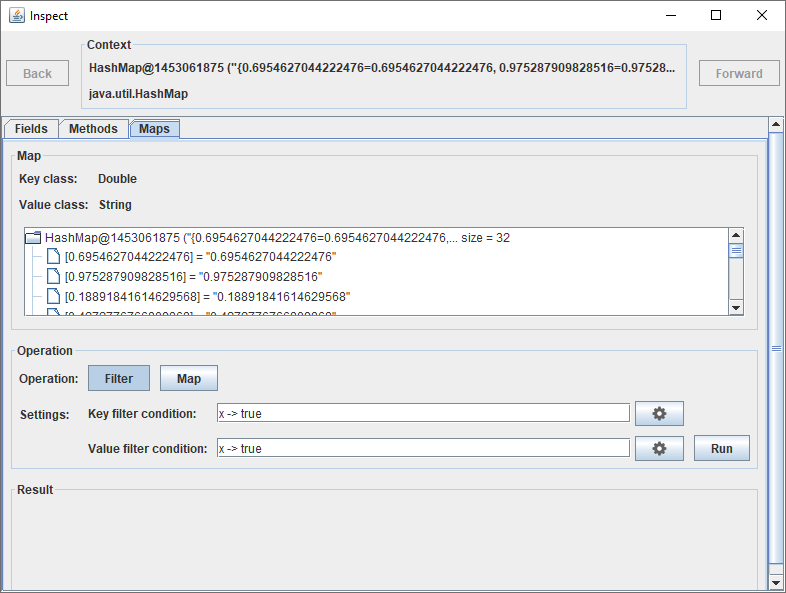

All expressions have to be expressed in term of `this`. See [Lambdas](#lambdas) for details.

### Filter

You can specify arbitrary predicates that are applicable to the keys or values of the `Map`, respectively. When pressing the "Run" button, the `Map` is filtered with these predicates and the result is displayed at the bottom:


In the previous example, a new map will be created with those entries whose keys exceed 0.6 and with values whose third character is not 9. Note that always both, keys and values, are filtered. If you only want to filter keys (values), then you can specify the filter expression `true` for the values (keys). 

### Map

You can specify arbitrary (unary) functions that are applicable to the keys and values of the `Map`. All keys and values will be mapped by these functions and collected into a map:


In the example above, a new map will be created with the squares of the original keys as new keys and the lengths of the original values as new values. Note that always both, keys and values, are mapped. If you only want to map keys (values), then you can specify the mapping expression `this` for the values (keys).

# Evaluation Dialog

The evaluation dialog allows you to evaluate expressions. There are two ways to open the evaluation dialog:

  1. You can hover over a Swing component and press the evaluation shortcut. The default shortcut is `Alt + F8`. The evaluation dialog becomes visible with the component as context, i.e., the keyword `this` refers to that component.
  
  1. You can right-click on any navigable element. In the context menu, you can then select the "Evaluate" action. The evaluation dialog becomes visible with the object represented by that node as context:<br/>
   

The evaluation dialog is rather simple: You enter the expression you want to evaluate and press enter. The result (or possibly a syntax error or an exception) is then displayed at the bottom of the dialog. There are two possibilities to configure how the expression is evaluated:

  * The ["evaluation mode"](#evaluation-modes) slider allows you to configure the evaluation mode. By default it is "mixed". This means that expressions are evaluated based on runtime types, but without side effects. Particularly, methods are not evaluated during parsing in order to determine the methods' runtime return type because this could cause side effects.
  * By clicking the settings button  you can configure many more [evaluation settings](#evaluation-settings-1).

Expression text fields have two features that simplify writing expressions:

  * Code completion: You can request code completions. The default shortcut for code completions is `Ctrl + Space`:<br/>
  
  
  * When entering method arguments, you can request the list of expected argument types. The default shortcut for this feature is `Ctrl + P`:<br/>
  

## Evaluation Settings

The evaluation settings dialog consists of for tabs:  

  1. General Settings
  1. Variables
  1. Imports
  1. Custom Hierarchy

In the "General Settings" tab you can specify the minimum access modifier fields and methods must have in order to be accessible in expressions. Additionally, you can enable/disable [dynamic typing](#dynamic-typing):

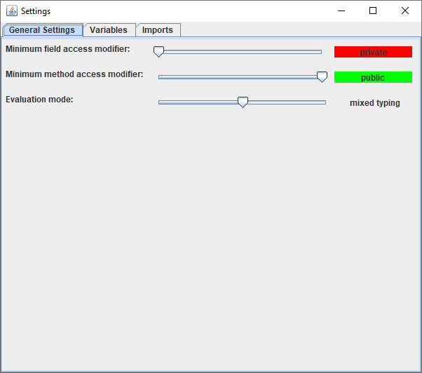

In the "Variables" tab you can see which [variables](#variables) are currently defined and you can specify which variables are hard-referenced by Marple. Additionally, you can import variables from named slots or export variables to named slots. See [Debug Support](#debug-support) for details about named and unnamed slots:

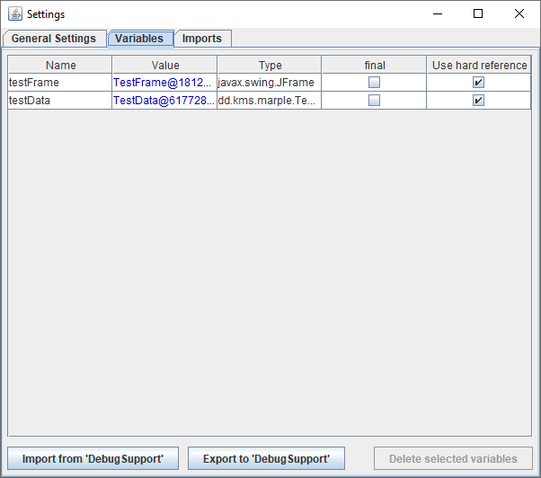  

In the "Imports" tab you can manage the [imported packages and classes](#imports).


In the "Custom Hierarchy" tab you can see the whole hierarchy that can be accessed in expressions via a language extension: 


In this example, we wrapped the file/directory structure under the user home directory as custom hierarchy using `File`s as user objects attached to the nodes. With the expression "{AppData#Local#Programs}" we can then retrieve the `File` instance that points to the file "C:\Users\Yoda\AppData\Local\Programs":<br/>


Note that this hierarchy is not hard-coded, but users can configure Marple to support arbitrary hierarchies. Additionally, Marple supports code completion for these hierarchies, even if they contain spaces. See [Custom Hierarchy](#custom-hierarchy) for details. 

### Evaluation Modes

Marple provides three different evaluation modes:

* static typing
* dynamic typing
* mixed typing

With static typing, expressions are evaluated based on declared types. You can only call methods and access fields that the declared types provide. When you need to analyze the runtime type, then you have to cast the instance to that type.

With dynamic typing, expressions are evaluated based on runtime types. That saves you unnecessary casts, but forces the evaluation framework to evaluate subexpressions to determine the runtime type. In particular, methods will be executed even during code completion. This can be critical if the method has side effects or if its evaluation is expensive.

Mixed typing is like dynamic typing, but without side effects. Particularly, no methods will be evaluated before the whole expression is evaluated. Instead, like with static typing the type of the value returned by a method is assumed to be the return type declared by the method.

Consider a `JPanel` whose 11'th component is a `JButton`:<br/>
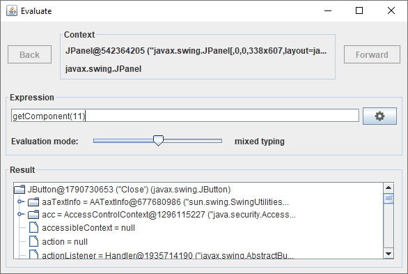

When trying to retrieve the text from that button without dynamic typing, we get an exception that the method `getText()` is unknown:<br/>
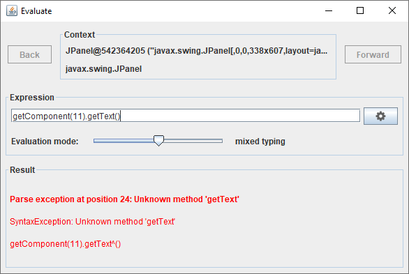
The reason is that the declared return type of `getComponent()` is `Component`, which does not provide a method `getText()`. Without dynamic typing, one had to cast that component to `JButton` in order to call `getText()` on it. 

With dynamic typing activated, this cast is not required:<br/>
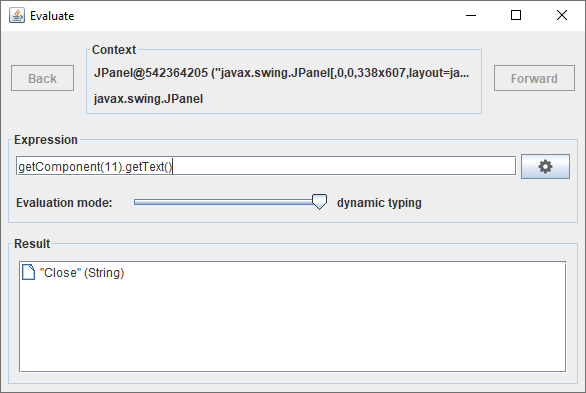
In this case, the parser evaluates the call to `getComponent()` and recognizes that the result is a `JButton`, which provides a method `getText()`.

### Variables

You can introduce variables that can be access from within expressions. Variables can be preconfigured via the API and changed at runtime by the user. There are several ways to manage variables:

  1. You can select the ["Add to variables" action](#add-to-variables-action) in the context menu of a [navigable element](#navigable-elements). This opens the [variables dialog](#variables) where you can enter the name of the variable. You can also delete or rename variables in the variables dialog there.
  1. The content of the variables dialog is also shown in the "Variables" tab in the [evaluation settings dialog](#evaluation-settings-1) that is opened when pressing the settings button  behind an expression input field.

The variables dialog looks as follows:

 

For each variable you have to specify if Marple should keep a hard or a weak reference to it. In most cases it will be a good idea to use only weak references in order to avoid prolonging the lifetime of instances unnecessarily. You should only use hard references when you intend to inspect an object even after its natural lifetime.

In the variables dialog you can import all named slots from the [debug support](#debug-support) as variables, overwriting all existing variables, or you can export all variables to named slots of the debug support, overwriting existing slots. The difference between variables and named slots is that variables are meant to be referenced when parsing expressions, while named slots are used to transfer data between Marple and an external debugger. 

### Imports

When you specify imports, then you do not have to fully qualify classes in the specified package or specified classes. Imports can be preconfigured via the API and can be changed by the user at runtime. 

### Custom Hierarchy

Some applications hold some of their data in a tree. Since the classic Java syntax is class-based, it does not distinguish between different instances of the same class. In a typical API, accessing the 10th child of a node is done via a cryptic call like node.getChild(9) or something similar. From Java's point of view, the 10th node is nothing special but only one of many nodes. For a user, this more or less anonymous access is unsatisfying because in most cases the nodes have individual names that are displayed to him. This can be, e.g., file names in a directory. Accessing the files only by index is as unintuitive as labeling the files in a directory just "file 0", "file 1", etc.

The concept of a custom hierarchy overcomes this anonymity of nodes by preconfiguring Marple with a custom hierarchy. The custom hierarchy specifies which node has which children by specifying the available names. Additionally, each node may carry an object it represents. The objects are the pieces of data that are organized in a tree-structure. The structure is only there for classification and navigation.

Note that the custom hierarchy configuration cannot be changed at runtime, but only at compile time. However, nodes are queried on demand, so the configured hierarchy can be dynamic and change over time, but according to a fixed logic. 

To access the data object of a certain node in the tree, we had to extend the Java syntax. Let us consider again the example above where the custom hierarchy represents the file/directory structure, say in the user home directory. The node names are the file or directory names and the data behind a node is the `File` instance that points to that file. The syntax for accessing the `File` instance corresponding the directory "\<user home\>\AppData\Local\Programs" is

    {AppData#Local#Programs}

Hence, with the custom hierarchy configured as described in this example, you could reference arbitrary files within an expression using this extended Java syntax. One benefit of this approach is code completion: While typing, Marple will automatically suggest nodes under the current node:


This example is, of course, not very interesting. It is much easier to use your favorite file browser to navigate to the file you are interested in, copy its file path and then call the `File` constructor. However, this alternative does not exist for application-specific data that is organized in a custom tree structure. 

# Snapshot Dialog

The snapshot dialog can be opened for `JComponent`s, `Image`s, `Icon`s, and `Paint`s via the "Snapshot" action from the context menu of a navigable element that represents it. Its primary purpose is to render it. This also works for `JComponents` that are currently not visible and have not yet been rendered. Particulary for `Image`s, `Icon`s, and `Paint`s it is helpful because it provides an easy way to see what these instances represent:


You can also save the screenshot to a file or copy it to the clipboard.

One notable option is the live preview. When activated, then the content displayed in the snapshot dialog is updated when hovering over a [navigable element](#navigable-elements) that represents an object that is supported by this dialog. This is helpful if you are looking for a certain component in a list of components.

# Debug Support

Marple is a nice in-application tool for quickly analyzing objects. However, real debuggers are much more powerful and have much more sophisticated features. Nevertheless, it is sometimes not so simple to reach the object you want to analyze with your debugger. Marple can be used to find objects in such cases, either by navigating along [navigable elements](#navigable-elements) or by searching them in the [search dialog](#search-dialog). The debug support bridges between Marple and external debuggers to make objects known by Marple available to them or vice versa:

 

The debug support dialog is a graphical user interface for accessing the class `DebugSupport`. It can be opened in one of the following ways:

  1. You can hover over a Swing component and press the debug support shortcut. The default shortcut is `Ctrl + Shift + D`. The debug support dialog becomes visible with the component as context, i.e., when entering expressions, the keyword `this` refers to that component.
  1. You can right-click onto a navigable element and select the ["Debug support" action](#debug-support-action). The debug support becomes visible with the object of the navigable element as context.

In the remainder of this section we discuss the features provided by the debug support. 

### Unnamed Slots

The class `DebugSupport` contains an array `SLOTS` of 5 elements. These elements are called "unnamed slots".

Unnamed slots are easy to access from a debugger (just type, e.g., `DebugSupport.SLOTS[0]`) and useful if you want to transfer a small number of instance to the debugger.

To set a value of one of these slots, you can simply click onto the text field and enter an expression:


### Named Slots

As the term suggests, named slots allow you to assign instances a name under which they may be looked up. To access a slot with the name `"myCustomSlot"`, call `DebugSupport.getSlotValue("myCustomSlot")` in the debugger. You can also set the value of a named slot from the debugger to transfer data to Marple. The following table lists the available methods for named slots:

|Method|Description|
|---|---|
|`getSlotNames()`|Returns a `Collection`of the names of the currently available named slots.|
|`getSlotValue(slotName)`|Returns the value of the specified named slot.|
|`setSlotValue(slotName, value)`|Sets the specified value to the specified named slot (possibly creating it if it does not exist) if the slot name is valid. Returns true if the slot name was valid.|
|`renameSlot(oldSlotName, newSlotName)`|Renames the specified named slot and returns true if the renaming was successful.|
|`clearNamedSlots()`|Clears all named slots.|
|`deleteSlot(slotName)`|Deletes the named slot with the specified name.|

Named slots are a bit less convenient to use than unnamed slots, but you can use expressive names, which can be helpful if you have to transfer multiple instances between Marple and the debugger.

You can manage named slots with the "Add slot" and "Delete selected slots" buttons. You can rename named slots by simply clicking into their name text field. To set the value of a named slot you have to click into the text field and enter an expression.    

### Importing and Exporting Variables

[Variables](#variables) and named slots are very similar, but they have a different purpose: Variables are meant to be reference from within expressions, whereas named slots are meant to be accessible by external debuggers. Nevertheless, they share enough similarity that Marple provides a way to import/export variables to/from named slots. You can do so in the variables dialog, which will be opened by clicking onto the "Open variable dialog" button, or as described in the section [Variables](#variables). The export feature is an easy way to share all variables you introduced in Marple with the debugger.

### Breakpoint Trigger

In order to start the debugging process, you need the debugger to pause at a breakpoint. For this, you have to find a way to trigger that breakpoint. This can be difficult since you need detailed information about the application's workflow. This is the motivation for the breakpoint trigger feature.

In the debug support dialog, you can specify a method that is called when clicking the "Trigger" button. You can choose between a preconfigured method and a custom method. The default preconfigured method is `DebugSupport.triggerBreakpoint()`. After choosing a trigger method, you must set a breakpoint in there, click the "Trigger" button and the debugger will pause at that breakpoint.

# Search Dialog

In the search dialog you can find paths from a root instance to a concrete instance or instances of a certain class that match a user-defined search criterion:


Potential directed edges of this path exist

   * from an instance to any of its fields,
   * from `Iterable`s and arrays to their elements, and
   * from `Map`s and `Multimap`s to their keys and values.

You can control which edge types and paths are considered by the following options:

  * non-static fields: If selected, then edges from instances to static fields of their classes are ignored.
  * pure fields only: If selected, then only edges from instances to their fields are considered.
  * limit search depths: If selected, then paths that are longer than the specified length are ignored.

There are two ways to open the search dialog:

  1. You can hover over a Swing component and press the instance search shortcut. The default shortcut is `Ctrl + Shift + F`. The search dialog becomes visible with the component as root of the search.
  1. You can right-click onto a navigable element and select the [search instances from here or the search this instance action](#search-instances-from-here-and-search-this-instance-action). In both cases the search dialog becomes visible. The first action sets the object of the navigable element as search root, the second action sets it as target instance.

Since you have to set root and target, you will often use both actions one after another. This is possible since this dialog is, like many other Marple dialogs, non-modal.

Searching instances may be helpful for analyzing memory leaks: If you already know that a certain instance has not been disposed, which instance keeps a reference to it and why. 

# Open Source License Acknowledgement

Marple utilizes the following open source projects:
 
## AutoComplete
https://github.com/bobbylight/autocomplete

Copyright (c) 2012, Robert Futrell. 

AutoComplete is licensed under the [Modified BSD license](https://opensource.org/licenses/BSD-3-Clause).
 
## Guava: Google Core Libraries for Java
https://github.com/google/guava

Guava is licensed under the [Apache License 2.0](http://www.apache.org/licenses/LICENSE-2.0).

## Zenodot
https://github.com/tbrunsch/Zenodot

Zenodot is licensed under the [MIT License](https://opensource.org/licenses/MIT).
