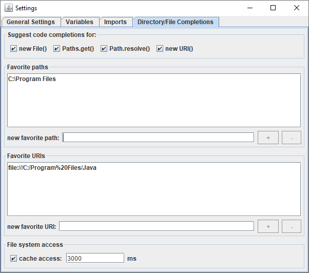

# Directory Completions UI

This Marple extension provides a graphical user interface for the Zenodot extension "Directory Completions".

<!-- START doctoc generated TOC please keep comment here to allow auto update -->
<!-- DON'T EDIT THIS SECTION, INSTEAD RE-RUN doctoc TO UPDATE -->
# Table of Contents

- [Target](#target)
- [Features](#features)
  - [Hierarchical Structure Analysis](#hierarchical-structure-analysis)
  - [Component, Image, and Color Previews](#component-image-and-color-previews)
  - [Highlighting of Components](#highlighting-of-components)
  - [Analysis Support for Iterables, Arrays, and Maps](#analysis-support-for-iterables-arrays-and-maps)
  - [Expression Evaluation](#expression-evaluation)
  - [Instance-based Search](#instance-based-search)
  - [Data Exchange With Debuggers](#data-exchange-with-debuggers)
  - [Navigation](#navigation)
- [Default Shortcuts](#default-shortcuts)
- [Setup and Configuration](#setup-and-configuration)
  - [Component Hierarchy Model](#component-hierarchy-model)
  - [Evaluation Settings](#evaluation-settings)
  - [Visual Settings](#visual-settings)
    - [Object Views](#object-views)
  - [Custom Action Settings](#custom-action-settings)
    - [Example](#example)
  - [Security Settings](#security-settings)
  - [Key Settings](#key-settings)
  - [Parser Settings](#parser-settings)
- [Navigable Elements](#navigable-elements)
- [Actions](#actions)
  - [Inspect Action](#inspect-action)
  - [Highlight Component Action](#highlight-component-action)
  - [Snapshot Action](#snapshot-action)
  - [Add to Variables Action](#add-to-variables-action)
  - [Evaluate and Evaluate as Action](#evaluate-and-evaluate-as-action)
  - [Search Instances from Here and Search this Instance Action](#search-instances-from-here-and-search-this-instance-action)
  - [Copy String Representation Action](#copy-string-representation-action)
  - [Debug Support Action](#debug-support-action)
  - [Invoke Action](#invoke-action)
- [Inspection Dialog](#inspection-dialog)
  - [Component Hierarchy Tab](#component-hierarchy-tab)
  - [Fields Tab](#fields-tab)
  - [Methods Tab](#methods-tab)
  - [Iterables Tab](#iterables-tab)
    - [Filter](#filter)
    - [Map](#map)
    - [ForEach](#foreach)
    - [Collect](#collect)
    - [ToMap](#tomap)
    - [Count](#count)
    - [Group](#group)
    - [Stream-like Analysis](#stream-like-analysis)
  - [Maps Tab](#maps-tab)
    - [Filter](#filter-1)
    - [Map](#map-1)
- [Evaluation Dialog](#evaluation-dialog)
  - [Evaluation Settings](#evaluation-settings-1)
    - [Evaluation Modes](#evaluation-modes)
    - [Variables](#variables)
    - [Imports](#imports)
    - [Custom Hierarchy](#custom-hierarchy)
- [Snapshot Dialog](#snapshot-dialog)
- [Debug Support](#debug-support)
    - [Unnamed Slots](#unnamed-slots)
    - [Named Slots](#named-slots)
    - [Importing and Exporting Variables](#importing-and-exporting-variables)
- [Custom Actions](#custom-actions)
- [Search Dialog](#search-dialog)
- [Open Source License Acknowledgement](#open-source-license-acknowledgement)
  - [AutoComplete](#autocomplete)
  - [Guava: Google Core Libraries for Java](#guava-google-core-libraries-for-java)
  - [Zenodot](#zenodot)

<!-- END doctoc generated TOC please keep comment here to allow auto update -->

# Directory Completions

Marple uses Zenodot for evaluating expressions. Zenodot has an extension called "Directory Completions", which provides code completions for String literals in file system related methods and constructors, like `new File(String)` or `Paths.get(String, String...)`. This extension has some options the Marple user might reconfigure while Marple is running. This can be done by registering this Marple extension.

# Registering the Directory Completions UI Extension

The following code is the minimum that is needed to install Marple:

```
InspectionSettings inspectionSettings = ObjectInspectionFramework.createInspectionSettingsBuilder().build();
ObjectInspectionFramework.register(inspectionSettings);
```
This installs Marple without any customization. To register the Directory Completions UI extension, you have to configure and specify custom `EvaluationSettings` when creating the `InspectionSettings`:

```
EvaluationSettingsBuilder evaluationSettingsBuilder = EvaluationSettingsBuilder.create();
DirectoryCompletionsUI.create().register(evaluationSettingsBuilder);
InspectionSettings inspectionSettings = ObjectInspectionFramework.createInspectionSettingsBuilder()
			.evaluationSettings(evaluationSettings)
			.build();
ObjectInspectionFramework.register(inspectionSettings);
```

After registering this Marple extension there will be a new tab "Directory/File Completions" in the evaluation settings dialog:



# Options

You can specify three kinds of options (cf. the README of the Zenodot extension "Directory Completions" for details):

* Completion targets: Specifies for which methods or constructors directory completions should be provided.
* Caching: Lets you specify whether and how long you want to cache results of file system accesses.
* Favorites: Lets you specify favorite paths and URIs that will automatically be suggested.

While these options can be configured by the user via the UI, it is possible to predefine values via API by calling the corresponding methods of `DirectoryCompletionsUI`. Note that these predefined values are only relevant for the first time this extension is used. The reason is that Marple stores all options of this extension in its preferences file. When starting Marple the next time, then all settings of the last session will be restored, independent of the predefined values. 